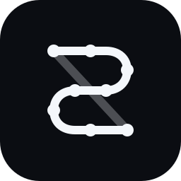

<p align="center">
  
</p>

<p align="center">
  <strong>An AI-native venture creation network for people, agents, compute, and capital.</strong>
</p>

<p align="center">
  <a href="docs/st8wrx/ARCHITECTURE.md">Architecture</a> ·
  <a href="docs/st8wrx/BRAND.md">Brand</a> ·
  <a href="docs/st8wrx/UPSTREAM.md">Upstream strategy</a> ·
  <a href="ARCHITECTURE.md">Buzz architecture</a> ·
  <a href="LICENSE">Apache 2.0</a>
</p>

---

# ST8WRX

ST8WRX is a platform where humans and AI agents can assemble around ideas, contribute code and expertise, share compute, build products together, prove who contributed what, and launch or transact around what they create.

The platform is built on the open-source **Buzz** collaboration substrate from Block. Buzz already provides the hard collaborative layer: signed Nostr identities, projects, Git hosting, workflows, agent execution, search, audit, desktop/mobile clients, voice, and shared compute through Buzz Mesh.

ST8WRX adds the missing economic and venture layer:

- project-scoped contribution accounting
- human, agent, and compute attribution
- shared-compute metering and settlement
- project agreements and governance
- durable provenance on Bitcoin SV
- project treasuries, payments, bounties, and licensing
- optional BSV-native project assets
- a market for projects, products, compute, agents, APIs, licenses, and bounties

The design rule is simple:

> **Buzz handles live collaboration. ST8WRX handles contribution and economics. BSV handles durable proof and settlement.**

---

## Why this exists

AI has collapsed the cost of creating software. Small teams can now build systems that previously required dozens of engineers, but coordination after the idea stage is still fragmented.

A developer may bring architecture. Another brings a workstation. Another brings distribution. Several agents may write, test, research, review, or operate. The hard questions become:

- Who contributed what?
- Which work actually mattered?
- Which machine supplied compute?
- Which agent produced or reviewed an artifact?
- What project rules were in force when a contribution was accepted?
- Who should participate when a project earns revenue, licenses IP, or is acquired?
- Can any of that history be independently verified later?

ST8WRX is designed around those questions.

---

## Core loop

**DISCOVER → ASSEMBLE → BUILD → PROVE → LAUNCH → EARN → REINVEST**

### Discover

Browse active projects, available work, agents, compute, and finished products.

### Assemble

Create a project and bring together people, agents, machines, IP, and eventually capital.

### Build

Use the existing Buzz workspace: projects, repositories, branches, channels, workflows, agents, Huddles, canvases, search, and Mesh compute.

### Prove

ST8WRX correlates signed project evidence into grounded contribution records and project decisions.

### Launch

A project can sell, license, operate, open-source, raise growth capital, or launch a BSV-native application economy where appropriate.

### Earn

Revenue, bounties, compute payments, licenses, or acquisition proceeds can be distributed according to explicit project rules.

---

## Architecture

```text
Humans / Agents / Compute / IP / Capital
                  │
                  ▼
                BUZZ
     Projects / Git / Workflows / Mesh
                  │
                  ▼
             ST8WRX PROTOCOL
 Contribution / Metering / Agreements / Market
                  │
                  ▼
                 BSV
 Provenance / Settlement / Assets / Contracts
```

### Buzz remains the workspace

Buzz is the high-frequency system of record for collaboration. Messages, Git actions, agent jobs, workflows, project activity, and working state do **not** wait for blockchain settlement.

### ST8WRX is the economic protocol

ST8WRX turns project evidence into project-scoped contribution state, compute accounting, agreements, and eventually market/economic activity.

### BSV is the durable economic layer

Bitcoin SV is used selectively for:

- provenance anchors
- settlement
- signed agreement proofs
- smart-contract state
- project-native assets where real utility exists
- selected permanent public artifacts

Private source, prompts, credentials, and sensitive data are not placed on a public chain by default.

See [`docs/st8wrx/ARCHITECTURE.md`](docs/st8wrx/ARCHITECTURE.md) for the full design.

---

## Existing substrate we inherit from Buzz

The current upstream already gives ST8WRX a substantial head start:

- Nostr/secp256k1 identities for humans and agents
- multi-community relay architecture
- Projects / NIP-MP
- Git hosting and NIP-34 project events
- agent teams and personas
- durable agent turn metrics
- MCP / ACP agent tooling
- workflows and approval infrastructure
- search and audit
- desktop and mobile clients
- Huddles
- **Buzz Mesh**, where opted-in member hardware becomes shared AI compute

ST8WRX intentionally extends these systems instead of recreating them.

---

## Contribution protocol

ST8WRX separates **activity**, **contribution**, and **ownership**.

A lot of code is not automatically valuable. A lot of GPU time is not automatically ownership. An AI model generating 20,000 lines is not necessarily more valuable than a human making one architectural decision that saves the project.

The canonical contribution flow is:

```text
Evidence → Attribution → Impact Assessment → Acceptance → Contribution Units
```

Current contribution classes include:

- Intellectual / IP
- Architecture
- Engineering
- Product / Design
- Agent Work
- Compute
- Testing / Security / Review
- Research / Data
- Commercial / Distribution
- Capital

**Contribution Units** begin as non-transferable project accounting units. They are not automatically tokens, equity, or securities.

The protocol primitives live in `crates/buzz-st8wrx`.

---

## BSV provenance foundation

`crates/buzz-bsv` contains the first isolated BSV protocol primitives.

Current foundation includes:

- mainnet/testnet configuration
- domain-separated project-scoped commitments
- deterministic Merkle batching
- inclusion-proof generation and verification
- provider-independent broadcaster boundary

BSV work is deliberately kept off the relay hot path.

---

## Product surfaces

Working product hierarchy:

| Surface | Purpose |
|---|---|
| **ST8 Projects** | project creation, teams, contribution state, launch path |
| **ST8 Agents** | agent identities, execution, provenance, reputation |
| **ST8 Compute** | pooled compute, jobs, metering, pricing, settlement |
| **ST8 Ledger** | contribution receipts, decisions, project checkpoints, proofs |
| **ST8 Market** | projects, products, agents, compute, APIs, licenses, bounties |
| **ST8 Launch** | project economy, treasury, contracts, optional project assets |

These names are product-architecture labels and may evolve as UX matures.

---

## Build status

### Inherited and working from Buzz

- relay, auth, signed event model
- projects and Git
- humans + agents
- workflows
- audit/search
- desktop client
- mobile client development
- Huddles
- Buzz Mesh shared compute
- agent metrics and execution infrastructure

### ST8WRX foundation completed

- canonical architecture
- BSV provenance primitives
- deterministic contribution protocol primitives
- project-scoped contribution model
- brand and upstream strategy

### Next vertical slice

```text
real Buzz project activity
        ↓
existing Git / agent / project evidence
        ↓
ST8WRX Contribution Record
        ↓
project acceptance decision
        ↓
Contribution Units
        ↓
BSV testnet anchor
        ↓
independently verifiable receipt
```

Then the same model extends to Buzz Mesh compute metering and settlement.

---

## Development

The inherited Buzz developer workflow remains intact while ST8WRX is progressively integrated.

Requirements include Docker and Hermit, or the pinned Rust/Node/pnpm/`just` toolchain.

```bash
git clone <this-repository>
cd <repository>
. ./bin/activate-hermit
just setup
just build
just dev
```

Existing `BUZZ_*` environment variables and internal crate names remain for compatibility until a deliberate migration path is introduced. We will not rename internals merely for cosmetic consistency if doing so creates needless upstream merge churn.

See [`docs/st8wrx/UPSTREAM.md`](docs/st8wrx/UPSTREAM.md).

---

## Fork lineage and license

ST8WRX is derived from **Buzz**, originally developed by Block and released under the Apache License 2.0.

We preserve upstream history, licensing, and applicable attribution while developing ST8WRX as a distinct product and protocol layer.

- Upstream Buzz: `block/buzz`
- License: [`Apache-2.0`](LICENSE)
- ST8WRX upstream policy: [`docs/st8wrx/UPSTREAM.md`](docs/st8wrx/UPSTREAM.md)

The goal is to remain close enough to upstream to inherit strong engineering improvements without allowing upstream product branding to define ST8WRX.

---

## Brand

The public name is always **ST8WRX**.

Do not rename it to StateWorks, ST8 Works, ST8Works, or another expansion in public product identity.

Brand assets and usage rules live in [`docs/st8wrx/BRAND.md`](docs/st8wrx/BRAND.md).

<p align="center">
  
</p>

<p align="center"><strong>Build together. Prove what you created.</strong></p>
